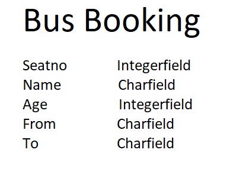
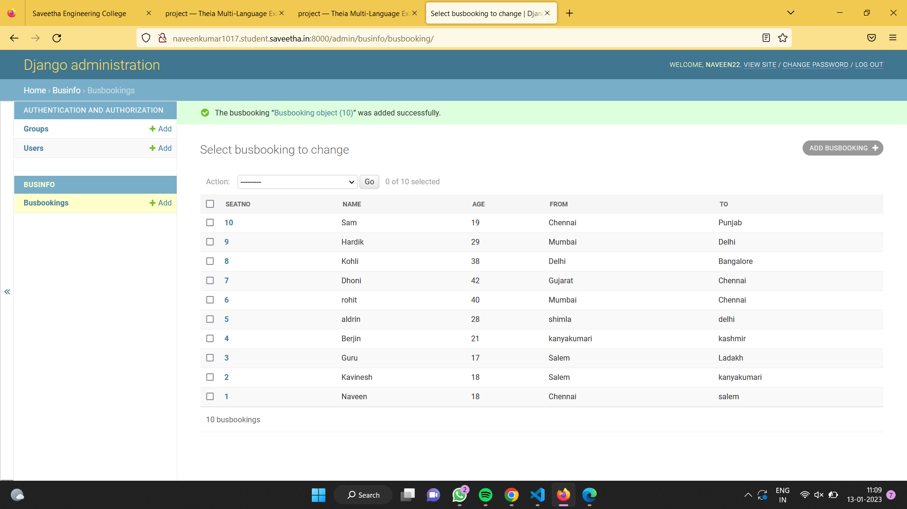

# Django ORM Web Application

## AIM
To develop a Django application to store and retrieve data from a database using Object Relational Mapping(ORM).

## Entity Relationship Diagram

Busbooking Entity diagram


## DESIGN STEPS

### STEP 1:
Clone the repository to theia ide. start a new app inside the project folder.

### STEP 2:
Type the appropriate code for your table and provide appropriate data types to the columns.

### STEP 3:
Create a report about your project in readme.md file and upload the django.orm.app folder to your remote repository.

## PROGRAM
```
from django.db import models
from django.contrib import admin

# Create your models here.
class Busbooking(models.Model):
    Seatno =models.IntegerField(primary_key=True, help_text="Seatno")
    Name =models.CharField(max_length=100)
    Age =models.IntegerField()
    From =models.CharField(max_length=100)
    To=models.CharField(max_length=100)
class Businfo(admin.ModelAdmin):
    list_display = ('Seatno','Name','Age','From','To')
```

## OUTPUT



## RESULT
Thus the project is developed to have Bus booking information database